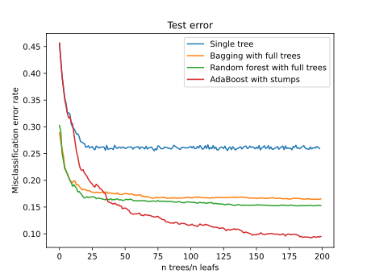
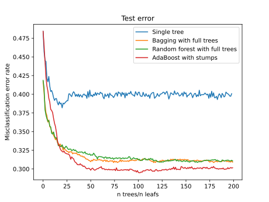

## 

:::::::::::::: {.columns}
::: {.column width="50%"}

[{height=20%}](https://ante.dk)

:::
::: {.column width="50%"}
- Data Scientist and Co-founder

- Legal tech start-up

- NLP-powered search engine

- Extract meta data from plain text

- Index structured data in a search engine 
:::
::::::::::::::

## Boosting - What is it ?

> A procedure to combine many __weak__ learners to produce a powerful __committee__. 
>
> [@friedman2009elements, sec. 10.1]

::: notes

- An ensemble method in Machine Learning
- A way of combining so-called weak learner
- into a powerful comittee i.e. by some means og aggregation or averaging

:::

## A brief history

:::::::::::::: {.columns}
::: {.column width="66%"}
{width=1200px}
:::

::: {.column width="33%"}
{height=130px}

[@valiant1984theory]

- Probably Approximately Correct Learner (PAC)  
- A formal theory of learnability 
- Proof of some broad classes of non-trivial boolean functions are learnable

:::
::::::::::::::

::: notes

- Valiant (1984) - A theory of the learnable
- Defines a mathematical framework for analyzing what classes of problems are learnable in polynomial time. 
- Introduces the Probably Approximately Correct Learner (PAC-learner). 
- Foundation of the field of computational learning theory.

:::

## Side note: PAC learning

- A _concept_ is Probably Approximately Learnable
  -  _if_ in polynomial time an _algorithm_ can deduce a _hypothesis_
  - with an error-rate $<\varepsilon$ with probability at least $1-\delta$
  - $s$ is the size of the _concept_ in bits, encoded appropriately
  - _for all_ $\varepsilon>0$ and $\delta \leq 1$

- The _learning protocol_ is:
  -  learn from examples asking an ORACLE
  -  the ORACLE returns a random example in _unit_ time (O(1))

## A brief history

:::::::::::::: {.columns}
::: {.column width="66%"}
{width=1200px}
:::

::: {.column width="33%"}
{height=130px}
{height=130px}

[@kearns1989crytographic]

- Introduce _weak learner_  
- Performs only slightly better than chance
- _Hypothesis boosting problem_: weak <=> strong ?

:::
::::::::::::::

::: notes
- The 1989 Crypto paper show that
- If either: 
  - Boolean formulae
  - Deterministic finite automata 
  - Constant-depth threshold circuits 
- are learnable cryptography is toast.

- Kearns and Valiant state as an open problem:
  - Can weak learners be "boosted" into strong learners?
  - I.e. can an algorithm transform weak leaners in to strong ones
  - The notion at the the time was "probably not" 

:::

## Side note: _weak_ and _strong_ learners

- _strongly learnable_ == PAC learnable

- A _concept_ is _weakly_ Learnable
  -  _if_ in polynomial time an _algorithm_ can deduce a _hypothesis_
  - with an error-rate $<\frac{1}{2} - 1/p(s)$ with probability at least $1-\delta$
  - _for all_ $0 < \delta \leq 1$
  - where $s$ is the size of the _concept_ in bits, encoded appropriately

## A brief history

:::::::::::::: {.columns}
::: {.column width="66%"}
{width=1200px}
:::

::: {.column width="33%"}
{height=130px}

[@schapire1990strength]

- Cracks the _Hypothesis boosting problem_
- Shows _weak learner_ <=> _strong learner_ 
- An algorithm constructing a strong learner from weak ones 🤯 

:::
::::::::::::::

## A brief history

:::::::::::::: {.columns}
::: {.column width="66%"}
{width=1200px}
:::

::: {.column width="33%"}
{height=130px}

[@freund1990majority]

- Implements a much more efficient _boosting_ algorithm
- Trains learners on weighted subsets of the data 
- Uses majority voting to predict

:::
::::::::::::::

## A brief history

:::::::::::::: {.columns}
::: {.column width="66%"}
{width=1200px}
:::

::: {.column width="33%"}
{height=130px}
{height=130px}

[@schapire1995decision]

- Introduces AdaBoost
- First practical boosting algorithm  
- Has been very effective

:::
::::::::::::::

## A brief history

:::::::::::::: {.columns}
::: {.column width="66%"}
{width=1200px}
:::

::: {.column width="33%"}
{height=130px}
{height=130px}

[@friedman2000special]

- Shows AdaBoost is *Stagewise Additive Logistic regression*

:::
::::::::::::::

## A brief history

:::::::::::::: {.columns}
::: {.column width="66%"}
{width=1200px}
:::

::: {.column width="33%"}
{height=130px}

[@friedman2001greedy]
[@mason1999boosting]

- Generalizes the _boosting_ concept 
- Describes _boosting_ as gradient descent in function space  

:::
::::::::::::::

## A brief history

:::::::::::::: {.columns}
::: {.column width="66%"}
{width=1200px}
:::

::: {.column width="33%"}
{height=130px}

[@chen2015higgs]

- Wins Kaggle contest on Higgs Boson using XGBoost 
- XGBoost quickly becomes the most winning algorithm  

:::
::::::::::::::

## Ensemble methods

- Bagging: Grow trees using _random subsets of data (with replacement)_
- Random forest: Grow trees using _random subset of features_
- Boosting: Grow trees on _re-weighted dataset_

. . . 

$$\text{Boosting} \succ \text{Random forest} \succ \text{Bagging} \succ \text{Tree}$$

## Simulation example

$$Y = \begin{cases}
1 & \text{if}\quad X_1^2 + \ldots + X_{10}^2 > 9.34 \\
-1 & \text{else}
\end{cases}\quad X_i\sim N(0,1)$$

{height=400px}

## Simulation example

## Bias/variance trade-off

$$\text{MSE} = \text{Bias}(\hat{f})^2 + \text{Var}(\hat{f}) + \text{Irreducible noise}$$

## Variance of averages

$$\text{Var}\left(\frac{1}{n}\sum_i^n X_i\right) = \frac{1}{n}\sum_i^n \text{Var}\left(X_i\right) + \frac{1}{n}\sum_{i\neq j} \text{Cov}(X_i, X_j)$$

. . .

$$\text{Variance of ensemble} = \frac{\text{Var(Trees)}}{n} + \frac{\text{Cov( Trees)}}{n}$$

## Variance and bias reduction

## Boosting

::: notes

- A collection of _weak learners_ (e.g. classifier) are trained sequentially.
- Each _learner_ is trained on the same dataset.
- Each example is re-weighted in each iteration
- Poorly predicted examples get higher weight 
- Well predicted examples get lower weight
:::

## Forward Stagewise Additive Learning

1. Initialize $f_0(x) = 0$
2. For $m=1$ to $M$:
   a. Compute $$(\beta_m, \gamma_m) = \underset{\beta, \gamma}{\text{argmin}} \sum_{i=1}^N L(y_i, f_{m-1}(x_i)+ \beta b(x_i;\gamma))$$
   b. Set $f_m(x) = f_{m-1}(x) + \beta_m b(x; \gamma_m)$

::: notes

- Boosting is a special case of _Forward Stagewise Additive Learning_
- It's an approximation technique for general additive models

:::
## Adaboost

1. Initialize weights $w_i=1/N$
2. For $m=1$ to $M$:
   1. Fit classifier $G_m(x)$ to training data using $w_i$'s
   2. Compute $$\text{err} = \frac{\sum_{i=1}^N w_i I(y_i \neq G_m(x_i))}{\sum_{i=1}^N w_i}$$
   3. Compute $\alpha_m = \log((1-\text{err})/\text{err})$ 
   4. Set $w_i \leftarrow w_i \exp(\alpha_m I(y_i \neq G_m(x_i)))$
3. Output $$G(x) = \text{sign}\left(\sum_{m=1}^M \alpha_m G_m(x)\right)$$

## Adaboost

- Not originally motivated in _Forward Stagewise Additive Learning_
- One can show that Adaboost is a stagewise additive model with loss $$L(y, f (x)) = \exp(−y f(x))$$ where $y\in \{-1, 1\}$ and $f(x) \in \mathbb{R}$.
- Usually for classification we use cross-entropy $$L(y, f(x)) = y^\prime \log p(x) + (1-y^\prime) \log(1- p(x)) $$ where $y^\prime = (y+1)/2\in \{0,1\}$ and $p(x)$ is the softmax function.
- In theory the two loss functions are equivalent
- On average they produce the same _model_ $f$

## Adaboost

- For finite samples the exponential loss has drawbacks
- To much weight is given to errors

. . .

{height=300px}

:::notes
Binomial loss function:

- $y^\ast = (y+1)/2$
- $p(x) = 1/(1 + exp(-2f(x)))$
- $l(y, p(x)) = y^\ast \log(p(x)) + (1-y^\ast) \log(1-p(x)) \Rightarrow$
- $l(y, f(x)) = log(1 + exp(-2yf(x)))$
:::

## Adaboost

- 10D nested spheres with noisy data

:::::::::::::: {.columns}
::: {.column width="50%"}

:::
::: {.column width="50%"}

:::
::::::::::::::

## Adaboost

- Adaboost has trouble on noisy data

. . .

:::::::::::::: {.columns}
::: {.column width="50%"}

:::
::: {.column width="50%"}

:::
::::::::::::::

:::notes
- The deviance yf is only negative if they have different signs
- So all negative values are errors
- The exponential loss eight these error much heavier
:::

## Adaboost

- How to fix Adaboost?
- Can we easily plug in a more robust loss function? 

. . .

> ::: nonincremental
> 1. Initialize weights $w_i=1/N$
> 2. For $m=1$ to $M$:
>    1. Fit classifier $G_m(x)$ to training data using $w_i$'s
>    2. Compute $\text{err} = \frac{\sum_{i=1}^N w_i I(y_i \neq G_m(x_i))}{\sum_{i=1}^N w_i}$
>    3. Compute $\alpha_m = \log((1-\text{err})/\text{err})$ 
>    4. Set $w_i \leftarrow w_i \exp(\alpha_m I(y_i \neq G_m(x_i)))$
> 3. Output $$G(x) = \text{sign}\left(\sum_{m=1}^M \alpha_m G_m(x)\right)$$
> :::

🤷‍♂️

## Gradient boosting 

- Introduced by [@friedman2001greedy] as a new view of boosting
- Makes it possible to _derive_ a boosting procedure
- Solves each forward stagewise step as _gradient descent_ in a function space
- Applies to any differentiable loss function

## Side note: Gradient boosting in SciKit Learn

_Scikit-learn documentation_:

> GB builds an additive model in a forward stage-wise fashion; it allows for the optimization of arbitrary differentiable loss functions.

. . .

Sound promising...

. . .

> `loss: {‘deviance’, ‘exponential’}`
>
> For loss ‘exponential’ gradient boosting recovers the AdaBoost algorithm.

. . .

🤦‍♂️

## Gradient boosting

- Consider the loss function,
$$\sum_{i=1}^N L\left(y_i, \sum_{m=1}^M \beta_m b(x_i, \gamma_m)\right)$$ 
- ... to be optimized over $\{\beta_m, \gamma_m\}_{m=1}^M$
- ... which might me intractable

## Gradient boosting
- We try to solve it in a Forward stagewise mamner
- For $1$ to $M$:
  - Optimize $$\sum_{i=1}^N L\left(y_i, f_{m-1}(x_i) + \beta_m b(x_i, \gamma_m)\right)$$ 
- where $f_m(x) = f_{m-1}(x) + \beta_m b(x_i, \gamma_m)$.
- If the basis functions are trees
- ... the stagewise minimization ca be difficult 

## Gradient boosting

- Consider the expected loss function $$\phi(f) = E[L(y,f(\boldsymbol{x}))]$$ 
- we seek $f$ that minimizes $\phi$
- Thats a difficult variational analysis problem
- Let's circumvent the problem...
- ... consider a dataset of $N$ observations instead $$\mathbf{f} = \{f(x_1), \ldots, f(x_N)\}$$

## Gradient boosting

- Lets minimize the empirical loss $$L(f) = \sum_{i=1}^N L(y_i, f(x_i))$$ wrt. $f(x_i)$ numerically.
- All numerical optimization is a series of $M$ steps towards optimum 
- Let each step be a vector $\mathbf{h}_m\in\mathbb{R}^N$
- The numerical optimum is $$\mathbf{f}_M = \sum_{m=1}^M \mathbf{h}_m$$

## Gradient boosting
- In _gradient descent_ each step $\mathbf{h}_m$ is $$-\rho \mathbf{g}_m$$ 
- ... where $g_{im}$ is $$\left[\frac{\partial L(y_i, f(x_i))}{\partial  f(x_i)}\right]_{f(x)=f_{m-1}(x)}$$
- The numerical optimization is then 
$$
\begin{align*}
  \mathbf{f}_m &= \mathbf{f}_{m-1} + \mathbf{h}_m\\
  &= \mathbf{f}_{m-1} -\rho \mathbf{g}_m 
\end{align*}
$$

## Gradient boosting

- Let's add _line search_, $$\mathbf{f}_m = \mathbf{f}_{m-1} - \rho_m \mathbf{g}_m$$ 
  where $\rho_m = \underset{\rho}{\text{argmin}}\quad L(\mathbf{f}_{m-1}-\rho \mathbf{g}_m )$
- This fits the pattern of _forward stagewise learning_ $$f_m(x) = f_{m-1}(x) + \beta_m b(x; \gamma_m)$$
- where $\rho_m$ is analogous to $\beta_m$
- and $-\mathbf{g}_m$ is analogous to $b(x; \gamma_m)$ 
- We can derive the gradient considering $f(x)$ a variable
- ... and easily compute $\mathbf{g}_m(f(x))$ using the value from the previous iteration $f_{m-1}(x)$
- ... we cannot compute $\mathbf{g}_m$ outside the dataset 🤔

## Gradient boosting

- The idea of [@friedman2001greedy]: 
  - Fit a _learner_ to $-\mathbf{g}_m$ $\rightarrow \hat{b}_m(x; \gamma_m)$ 
  - Forward stagewise step: $$f_m(x) = f_{m-1}(x) + \rho_m \hat{b}_m(x; \gamma_m)$$

## XGBoost

- Explicit regularization in loss function
- Newton boosting:
  - $\mathbf{h}_m$ is $$-\rho_m \mathbf{H}_m^{-1}\mathbf{g}_m$$
- Custom split point identification: "Weighted Quantile Sketch"
- Computationally optimized

## Learn more
:::::::::::::: {.columns}
::: {.column width="50%"}
[Elements of Statistical Learning](https://web.stanford.edu/~hastie/ElemStatLearn/) 

{height=400px}
:::
::: {.column width="50%"}
[Trevor Hastie - Gradient Boosting Talk (2014)](https://youtu.be/wPqtzj5VZus)

:::
::::::::::::::

## References {.allowframebreaks}
::: {#refs}
:::