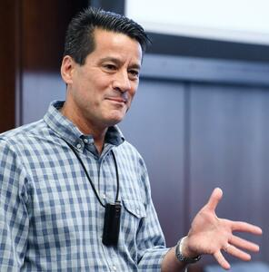

## Boosting high level view

> A procedure to combine many __weak__ learners to produce a powerful __committee__. 
>
> [@friedman2009elements, sec. 10.1]

## Boosting high level view

::: notes

- A collection of _weak learners_ (e.g. classifier) are trained sequentially.
- Each _learner_ is trained on the same dataset.
- Each example is re-weighted in each iteration
- Poorly predicted examples get higher weight 
- Well predicted examples get lower weight
:::

## A brief history

::: notes

- Valiant (1984) - A theory of the learnable: Defines a mathematical framework for analyzing what classes of problems are learnable in polynomial time. Introduces the Probably Approximately Correct Learner. Foundation of the field of computational learning theory.

:::

## A brief history

:::::::::::::: {.columns}
::: {.column width="33%"}
{#id .class height=130px}

{#id .class height=130px}
:::
::: {.column width="33%"}
{#id .class height=130px}

{#id .class height=130px}
:::
::: {.column width="33%"}
{#id .class height=130px}
:::
::::::::::::::

## Adaboost

$$\sum_{\theta\in\Theta}\frac{1}{n}$$

----

#### References
::: {#refs}
:::