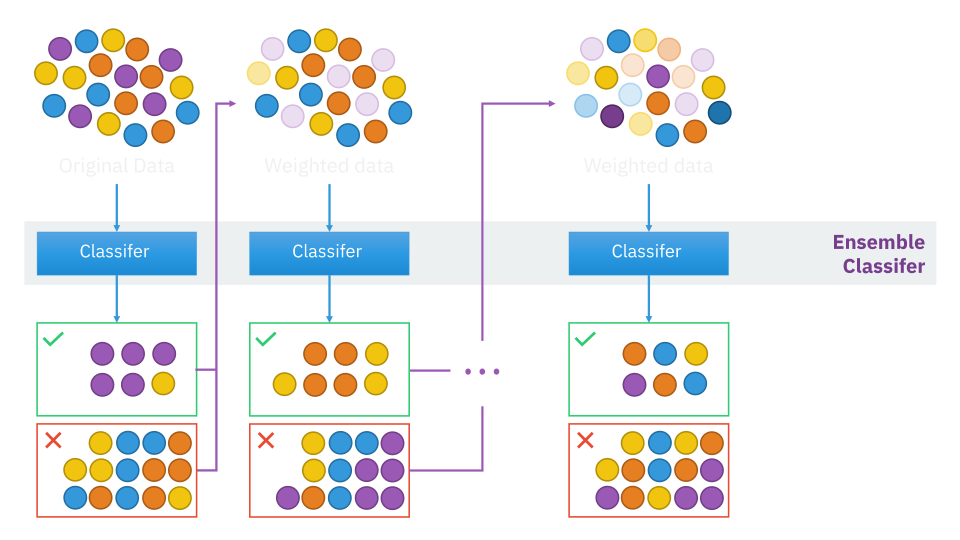

## Boosting high level view

> A procedure to combine many __weak__ learners to produce a powerful __committee__. 
>
> [@friedman2009elements, sec. 10.1]

## Boosting high level view

::: notes

- A collection of _weak learners_ (e.g. classifier) are trained sequentially.
- Each _learner_ is trained on the same dataset.
- Each example is re-weighted in each iteration
- Poorly predicted examples get higher weight 
- Well predicted examples get lower weight
:::

## A brief history

:::::::::::::: {.columns}
::: {.column width="66%"}
{width=1200px}
:::

::: {.column width="33%"}
{height=130px}

[@valiant1984theory]

- Probably Approximately Correct Learner (PAC)  
- A formal theory of learnability 
- Proof of some broad classes of non-trivial boolean functions are learnable

:::
::::::::::::::

::: notes

- Valiant (1984) - A theory of the learnable
- Defines a mathematical framework for analyzing what classes of problems are learnable in polynomial time. 
- Introduces the Probably Approximately Correct Learner (PAC-learner). 
- Foundation of the field of computational learning theory.

:::

## A brief history

:::::::::::::: {.columns}
::: {.column width="66%"}
{width=1200px}
:::

::: {.column width="33%"}
{height=130px}
{height=130px}

[@kearns1989crytographic]

- Introduce _weak learner_  
- Performs only slightly better than chance
- Can learners break RSA ? Apparently yes! 😳
- _Hypothesis boosting problem_: weak <=> strong ?

:::
::::::::::::::

::: notes
- The 1989 Crypto paper show that
- If either: 
  - Boolean formulae
  - Deterministic finite automata 
  - Constant-depth threshold circuits 
- are learnable cryptography is toast.

- Kearns and Valiant state as an open problem:
  - Can weak learners be "boosted" into strong learners?
  - I.e. can an algorithm transform weak leaners in to strong ones
  - The notion at the the time was "probably not" 

:::

## A brief history

:::::::::::::: {.columns}
::: {.column width="66%"}
{width=1200px}
:::

::: {.column width="33%"}
{height=130px}

[@schapire1990strength]

- Cracks the _Hypothesis boosting problem_
- Shows _weak learner_ <=> _strong learner_ 
- An algorithm constructing a strong learner from weak ones 🤯 

:::
::::::::::::::

## A brief history

:::::::::::::: {.columns}
::: {.column width="66%"}
{width=1200px}
:::

::: {.column width="33%"}
{height=130px}

[@freund1990majority]

- Implements a much more efficient _boosting_ algorithm
- Trains learners on weighted subsets of the data 
- Uses majority voting to predict

:::
::::::::::::::

## A brief history

:::::::::::::: {.columns}
::: {.column width="66%"}
{width=1200px}
:::

::: {.column width="33%"}
{height=130px}
{height=130px}

[@schapire1995decision]

- Introduces AdaBoost
- First practical boosting algorithm  
- Has been very effective

:::
::::::::::::::

## A brief history

:::::::::::::: {.columns}
::: {.column width="66%"}
{width=1200px}
:::

::: {.column width="33%"}
{height=130px}

[@friedman2001greedy]
[@mason1999boosting]

- Generalizes the _boosting_ concept 
- Describes _boosting_ as gradient descent in function space  

:::
::::::::::::::

## A brief history

:::::::::::::: {.columns}
::: {.column width="66%"}
{width=1200px}
:::

::: {.column width="33%"}
{height=130px}

[@chen2015higgs]

- Wins Kaggle contest on Higgs Boson using XGBoost 
- XGBoost quickly becomes the most winning algorithm  

:::
::::::::::::::

## Adaboost

$$\sum_{\theta\in\Theta}\frac{1}{n}$$

----

#### References {.allowframebreaks}
::: {#refs}
:::