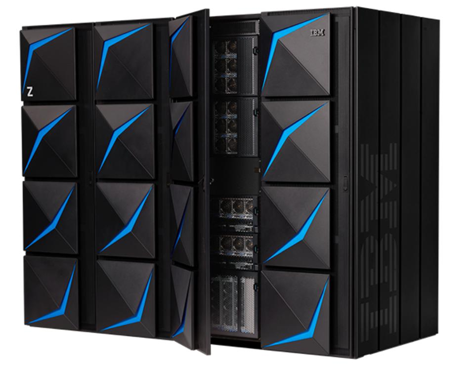

# What Are Microservices?
## Microservices At a Glance
> Microservices are an architecture choice.

> "type of service-oriented architecture" 

> *Microservices* are **independently releasable services** that are modelled around a **business domain**.

## Key Concepts of Microservices
### Independently Deployability
> If you take only one thing from this book, [...] it should be this: ensure that you embrace the concept of *independent deployability* of your microservices. 
### Modelled Around a Business Domain
> Arguably, with microservices we have made a decision to prioritize high cohesion of business functionality over high cohesion of technical functionality.
### Owning Their Own State
> One of the things I see people having the hardest time with is the idea that microservices should not share databases.

### Size
> .. the concept of size is actually one of the least interesting things.

> I urge people not to worry about size.

> First, how many microservices can you handle?

> Second, how do you define microservice boundaries to get the most out of them, without everything becoming a horribly coupled mess?

### Flexibility
> *"Microservices buy you options.”* - James Lewis, Director Thoughtworks
> The resulting flexibility on a number of axes — organizational, technical, scale, robustness.

### Alignment of Architecture and Organization

## The Monolith
What is a *Monolith*?

> I am primarily referring to a *unit of deployment*.

- The term *monolith* has become synonymous with "legacy". 
- The term *monolith* is also used in a  pejorative way.
- There are plenty of good application of *monolithic applications*.

> The sensible default architecture choice. - Sam Newman
> 
> I am looking for a reason to be convinced *to use* microservices, rather than looking for a reason *not to use* them. - Sam Newman 

- IBM z15 mainframe runs 1.2m transactions per second
- Mainframe application are written in COBOL

- Shopify case: Single Ruby on Rails single process monolith until 2016
- Shopify had:
  - 377,500 merchants at the end of 2016
  - Handling transaction of $42 million a day

- Shopify opted-out of using a microservices architecture and is running a modular monolith 

The three most common monothliths are:
- single-process monolith
- the modular monolith
- distributed monolith

### The Single-Process Monolith

- The process may be replicated across many machines for scale or rescilience

### The Modular Monolith

### The Distributed Monolith
- Multiple services
- Tightly coupled
- May have a shared database
- Disadvantages of distributed systems 
- Disadvantages of monolithic systems
- Worst of both worlds

### Monoliths and Delivery Contention
### Advantages of Monoliths
- Simpler deployment topology
- Simpler developer workflows
- Easier to monitor
- Easier to troubleshoot
- Simplified end-to-end testing
- Code re-use within the monolith - All the code is there just use it!.
  

## Enabling Technology
### Log Aggregation and Distributed Tracing

> at a bare minimum, I strongly advocate for the implementation of a log aggregation system as a prerequisite for adopting a microservice architecture - Sam Newman

### Containers and Kubernetes
### Streaming
### Public Cloud and Serverless

## Advantages of Microservices
### Technology Heterogeneity
### Robustness
### Scaling
### Ease of Deployment
### Organizational Alignment
### Composability

## Microservice Pain Points
### Developer Experience
### Technology Overload
### Reporting
### Monitoring and Troubleshooting
### Security
### Testing
### Latency
### Data Consistency

## Should I Use Microservices?
### Who They Might Not Work For
### Where They Work Well

## Summary

