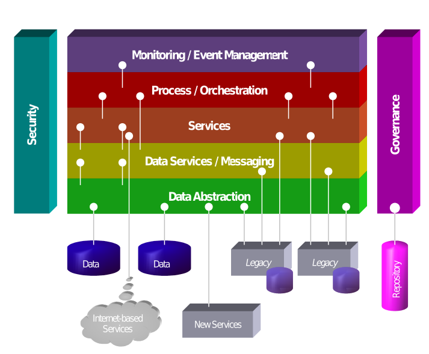
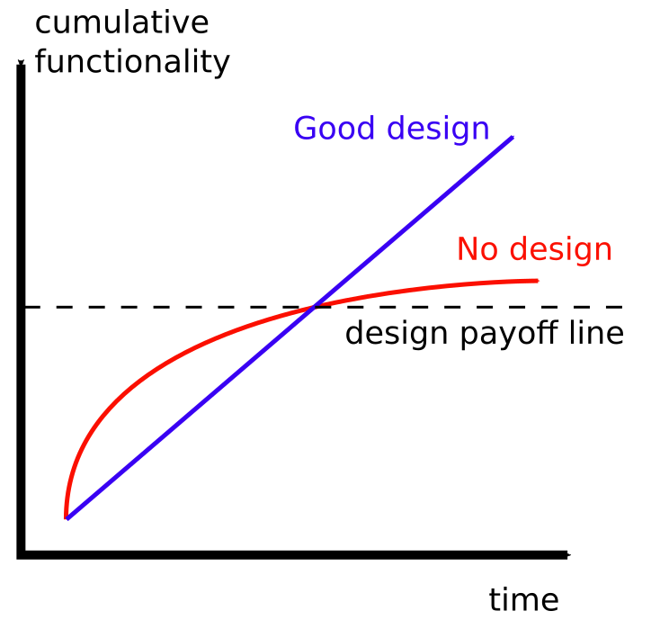

## Microservices At a Glance
- Microservices are an architecture choice 
- A type of service-oriented architecture (SOA)

---

## Microservices in one sentence

> *Microservices* are **independently releasable services**, each modelled around a **business domain**, usually communicating over a network.

---

## Example Microservice 
{ height=10em }

---

### Service oriented architecture (SOA)

- Concept came out of proprietary *remote procedure call* (RPC) technologies of the 80's and 90's (COBRA, DCOM)
- These old binary RPC technologies didn't work over the "internet"

---

### Service oriented architecture (SOA)
- In 2000 the XML-based *Simple Object Access Protocol* (SOAP) came about
- In 2003, Roy Schulte of Gartner Group, coined the term "Service Oriented Architecture"

---

### Service oriented architecture (SOA)

{ height=10em }
---
### Service oriented architecture (SOA)
- Not well defined
- Conflicting defintions
- Pushed by software vendors to sell middleware

---

### Service oriented architecture (SOA)
- SOA is to Microservices ...
- ... what Agile is to Scrum

# The Monolith
- The opposite of a microservice architecture
- What is a *Monolith*?
- Sam Newman : *One unit of deployment*

---

## The mainframe app

{ height=10em }

---

## The mainframe app
- IBM z15 mainframe runs 1.2m transactions per second
- 70 percent of Fortune 500 companies use IBM z mainframes
- Mainframes handle 90 percent of all credit card transactions.

---

## The mainframe app
- Mainframe application are written in COBOL (Common Business-Oriented Language)
- COBOL is a domain specific language
- Built-in decimal number system
- Built for fast "row operations"

---

## Shopify
{ height=5em }

- A Ruby on Rails single process monolith until 2016
- 377,500 merchants at the end of 2016
- Handling transaction of $42 million a day
- Opted for a *Modular Monolith*

---

## The monoliths

|Single process monolith | Modular Monolith | Distributed Monolith |
|-------|------|------|
|  |  |  |

---

### The Distributed Monolith
- Multiple services
- Tightly coupled
- May have a shared database
- Disadvantages of distributed systems 
- Disadvantages of monolithic systems
- Worst of both worlds 

---

## The good monolith - Advantages
- Simpler deployment topology
  - *Single main file on one server*
- Simpler developer workflows
  - *No need to mock external services*
- Simplified end-to-end testing
  - *The end-to-end flow is defined in code in one place* 
- Code re-use within the monolith
  - *Easy to keep the code DRY - Just import*

---

## The good monolith - Advantages
- Easier to monitor
  - *Just look at logs from one app*
  - *Just look at CPU and memory usage of one server*
- Easier to troubleshoot
  - *Easier to recreate failing scenario*

---

## Advantages of Microservices
- Technology Heterogeneity 
- Robustness 
- Scaling
- Ease of Deployment
- Organizational Alignment
- Composability

:::notes

- Each service can be written in whatever language
- If a single service fails the app as a whole doesn't need to fail
- Open up for horizontal scaling of parts of the system
- Small isolated units of deployment
- One team=One service
- New opportunities can arise from composing services
:::

---

## Concepts of Microservices
- Independently Deployability
- Modelled Around a Business Domain
- Owning Their Own State

---

### Independently Deployability

> If you take only one thing from this book, [...] it should be this: ensure that you embrace the concept of *independent deployability* of your microservices. 

:::notes
- Independent deployability enforces "loosely coupled" systems
- Enforces stable contracts between services
:::

---

### Modelled Around a Business Domain

> Arguably, with microservices we have made a decision to prioritize high cohesion of business functionality over high cohesion of technical functionality.

---

### Modelled Around a Business Domain
| Three tiers | Microservice |
| ------------|--------------|
|  |  |

---

### Owning Their Own State

> One of the things I see people having the hardest time with is the idea that microservices should not share databases.

---

## Microservice pain points
- Data Consistency
- Developer Experience
- Technology Overload
- Reporting
- Monitoring and Troubleshooting
- Security
- Testing
- Latency

---

### Data Consistency
- Data in a SQL database - consistency is handle by the DBMS
- Distributed transactions: 😏
- Sagas: 🤷‍♂️ 

---

### Developer Experience
- Impossible or difficult to run all services on one laptop
- Difficult to reason about the system

---

### Technology Overload

> There is a danger, though, that this wealth of new toys can lead to a form of technology fetishism - Sam Newman

> Microservices **buy** you options. - James Lewis, Director ThoughtWorks 
 
---

### Reporting

- In a monolith a report is only a SQL query away
- With distributed state it's much more difficult
- Enter the world of *data lakes*

---

### Monitoring and Troubleshooting

> At a bare minimum, I strongly advocate for the implementation of a log aggregation system as a prerequisite for adopting a microservice architecture - Sam Newman

---

### Security
- More network communication opens the attack surface
- Vulnerable for man-in-the-middle attacks

---

### Testing
- End-to-end test are near impossible
- Integration tests need mock services

---

### Latency
- Mre serialization adn de-srialization adds latency
- Flaky networks add latency

---

## Design Stamina

> I do see a temptation for startups to go microservice first. The reasoning goes, “If we’re really successful, we’ll need to scale!”  - Sam Newman

---

## Design Stamina
{ height=8em }

:::notes

The overall goal is always to not let development of new features be slowed down by code complexity.

But one needs to defer the step to a microservice when the needs of the system have become clear. 

These needs are learned well in a monolith. 
:::