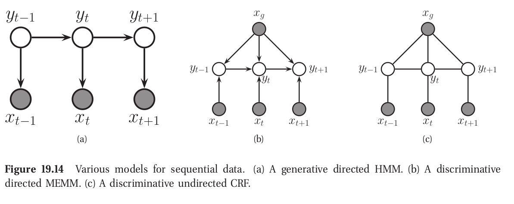

### About Me

::: incremental
- Senior Machine Learning Scientist at Alipes
  - News Trading Algorithms
  - Applied NLP and Machine Learning
- Msc. in Economics from University of Copenhagen from 2016
  - Fell into the "$Math$ and `Code`" pot at University
- Before joining Alipes
  - Automated Sports Betting
  - Co-Founded a Machine Learning Consultancy
  - Co-founded a NLP-powered Legal Tech start-up
:::

### Slides

{ width=40% }
[duffau.github.io/talks/sequence-tagging][3]

---


### Sequence Tagging

```txt
The price of the [Pizza Margherita] is [10 dollars]. 
                  FOOD                  AMOUNT
```

###  
#### Named Entity Recognition (NER) 
```txt
Jim   worked at    Acme Corp. near the beautiful London Bridge.
PER   O      O     ORG  ORG   O    O   O         LOC    LOC   EOS
```

#### Part-of-Speech (POS)
```txt
Jim   worked at    Acme Corp. near the beautiful London Bridge.
NOUN  VERB   PREP  NOUN NOUN  PREP DET ADJ       NOUN   NOUN  EOS
```

$$\begin{aligned}
\text{Labels}:\quad \mathbf{y} &= \{y_1, y_2, \ldots, y_T\}\\
\text{Features}:\quad \mathbf{x} &= \{\mathbf{x}_1, \mathbf{x}_2, \ldots, \mathbf{x}_T\}
\end{aligned}$$

## Evolution of NLP and Sequence tagging 

### 1954-1966 - AI Over-optimism and AI Winter
::: incremental
- 1954: IBM-Georgetown machine translation: Sixty Russian sentences translated into English
- 1957: Noam Chomsky *Syntactic Structures*: 
  - *Generative Grammar*: A system of rules that generate exactly those combinations of words that form grammatical sentences
  - *Anti-probabilistic*: "probabilistic models give no particular insight into some of the basic problems of syntactic structure."
:::

### 1954-1966 - AI Over-optimism and AI Winter
::: incremental
- 1958: H. A. Simon and Allen Newell:"within ten years a digital computer will discover and prove an important new mathematical theorem"
- 1960's: Slow progress in machine translation
- 1966: ALPAC report ledas to defunding of machine translation in US
- 1974–1980: First AI Winter
:::

### 1980's - Expert Systems
::: incremental
- Expert Systems
  - Knowledge base - Collected daa
  - Inference engine - Hand crafted expert rules
- Examples:
  - CADUCEUS: Medical expert system "most knowledge-intensive expert system in existence"
  - Dendral: Decision-making process and problem-solving behavior of organic chemists. 
:::

### Late 1980's and 1990's - Rise of Statistical Models
::: incremental
- Less dominance of Chomskyan theories of linguistics
- More computational power
- Availability of Annotated Datasets
- Give Rise to Statistical NLP
:::

### Late 1980's and 1990's - Rise Statistical Models
::: incremental
- 1988: First papers using Markov models for PoS [@derose1988grammatical; @church1989stochastic]
- 1989: Tutorial on Hidden Markov Models (HMM) for Speech [@rabiner1989tutorial]
- 1993: Penn Treebank Project
- 1995: WordNet: A Lexical Database for English, 6th Message Understanding Conference
- 1996: Maximum Entropy Markov Model (MEMM) published [@ratnaparkhi1996maximum]
- 2001: Conditional Random Fields (CRF) [@lafferty2001conditional]
:::

::: notes
- HMM: The first to encode sequential information for PoS
- Rabiner: HMM applied to speech since th 70's but only widely know in "recent years"
  - 33,500 citation
- Penn Treebank Project: 1 mio annotated tokens from WSJ
- MUC 6: https://aclanthology.org/volumes/M95-1/ 
  - Arranged by Naval Command and DARPA
  - A information extraction competition 10-20 participants from industry adn universities 6 months work
  - Defined evalution methods and metrics like precision, recall and f1
  - Task: 
    - MUC-4: "Terrorist activities in Latin America"
    - MUC-6: "Negotiation of Labor Disputes"
  - Coining the "NAmed Entity" at MUC-6
- MEMM:
  - Discriminative markov model - More direct model
  - Allows influence from features at any point in time 
- Condtional Random Fields:
  - Sequential like HMM and MEMM
  - Are discriminative (like MEMM)
  - Allows influence from features at any point in time (Like MEMM)
  - Solves the "label bias" issue of MEMM's
:::

### 2000's to 2010 - Large Corpus from the Web

- Standardization on benchmarks e.g. CoNLL 2003 [@sang2003introduction]
- Large raw (unannotated) dataset from the Web 
- Semi-supervised and Unsupervised Learning Approaches
- 2003: Multilayer perceptron beats Markov model in "next word prediction" [@bengio2000neural]
- Support Vector Machines for NER tagging

### 2010 to Today - Neural Models and Word Embeddings

- 2013-14: Word Embeddings (Word2Vec, GloVe) [@mikolov2013efficient, @pennington2014glove]
- 2015: Neural Net Revolution (BiLSTM-CRF [@huang2015bidirectional])
- 2017: "Attention is all you need" [@vaswani2017attention]
- 2019: First gen Transformers (BERT, RoBERTa, Electra)
- 2020: Large-Scale Pre-trained Language Models (GPT-3) 
- 2022: GPT 3.5 and ChatGPT 
- 2023: Large Language Models and Few-Shot Adaptation (GPT-4, Claude, LLaMA) 


### Papers Using Datasets ^1^

<div style="height:400px">
<canvas data-chart="line">
<!--
{
 "data": {
  "labels": [2020,2021,2022,2023,2024],
  "datasets":[
   {
    "data":[86,88,43,41,18],
    "label":"POS - Penn Treebank",
    "yAxisID": "y",
    "fill": false
   },
   {
    "data":[63,112,105,156, 195],
    "label":"QA - TriviaQA (Wiki + Web)",
    "yAxisID": "y1"
   },
   {
    "data":[16,30,54,160,327],
    "label":"NLI - HellaSwag Sentence Completion",
    "yAxisID": "y1"
   }
  ]
 },
 "options": {
  "scales": {
   "y": {
    "type": "linear",
    "display": true,
    "position": "left",
    "title": {
     "display": true,
     "text": "Published Papers"
    }
   },
   "y1": {
    "type": "linear",
    "display": true,
    "position": "right",
    "title": {
     "display": true,
     "text": "Published Papers"
    },
    "grid": {
     "drawOnChartArea": false
    }
   }
  }
 }
}
-->
</canvas>
</div>

Abstract tasks have taken over lower level tasks

::: footer
^1^ Source: https://paperswithcode.com/datasets
:::

::: notes
- Penn Tree Bank
  - Penn State Tree Bank
  - Initially released in 1992
  - First richly annotated text corpus 
  - 1 mio Annotated tokens (2500 stories) from Wall Street Journal Article from 1989 Wall Street Journal 
  - 2022: Sequence Aligment Ensemble-BART encoder: 98.15 Accuracy
    - Ensemble of BART models 
    - Weighted voting where weights a proportional to avg. alignment score with other predictions in ensemble  
  - 2018: BI-LSTM: 97.96 Accuracy
- TriviaQA: Challenging than QA pairs
  - Long context
  - Answers not optained by span prediction in question or context
  - 2017 University of Washington NLP
  - Claude 5 shots: 87.5 f1 score
  - https://paperswithcode.com/sota/question-answering-on-triviaqa
- HellaSwag: Common sense Natural Language Inference
  - "A woman sits at a piano," -> "She sets her fingers on the keys."
  - Humans have 95% accuracy
  - From Allen Institute for AI a Non-Profit research org.
  - GPT4 10 shots: 95.3 Accuracy
  - https://paperswithcode.com/sota/sentence-completion-on-hellaswag
:::

### NER Tagging Approaches


## CRF Training Demo

###
```python
import sklearn_crfsuite

def word2features(tokens, i):
    features = {
      "bias": 1.0,
      "word": tokens[i].lower(),
      "prev_word": tokens[i-1],
      "next_word": tokens[i+1],
      "shape": re.sub("X", "\d", word)
    }
    return features
```

---

```python
import datasets

def load_X_y(dataset_id="eriktks/conll2003", split="train"):
    data = datasets.load_dataset(dataset_id)
    sentences = data[split]["tokens"]
    labels = data[split]["ner_tags"]
    label_names = data[split].features["ner_tags"].feature.names

    X, y = [], []
    for (sentence, label_seq), i in enumerate(sentences, labels):
      X.append(word2features(tokens, i)) 
      y.append([label_names[label_id] in label_seq])
    return X, y
```
---

```python
import sklearn_crfsuite
from sklearn_crfsuite import metrics

X, y = load_X_y(split="train")
crf = sklearn_crfsuite.CRF(
  algorithm='lbfgs',
  c1=0.5, 
  c2=0.01,
)
crf.fit(X, y)

X_test, y_test = load_X_y(split="test")
y_pred = crf.predict(X_test)

print(metrics.flat_classification_report(
    y_test, y_pred, labels=sorted_labels, digits=3
))
```

---

```bash
              precision    recall  f1-score   support

       B-LOC      0.852     0.837     0.844      1668
       I-LOC      0.741     0.623     0.677       257
      B-MISC      0.796     0.758     0.777       702
      I-MISC      0.647     0.653     0.650       216
       B-ORG      0.778     0.722     0.749      1661
       I-ORG      0.666     0.734     0.699       835
       B-PER      0.839     0.853     0.846      1617
       I-PER      0.879     0.952     0.914      1156

   micro avg      0.805     0.804     0.805      8112
   macro avg      0.775     0.766     0.769      8112
weighted avg      0.805     0.804     0.804      8112
```

### Typical features

- `word`: one-hot encoding of current word
- `+1:word`: one-hot encoding of next word
- `word length`
- `word shape`:  `$1,230` -> `$x,xxx`
- `word.isupper()`
- POS tag
- Adjacent bi-grams adn tri-grams
- Windows of words
- Gazetteers

## CRF Theory
### Conditional Random Field model - Quick overview

{width=40%}

::: incremental
- Discriminative as opposed to Generative
- Bidirectional influence from labels
- Richer Word Feature transformations
- Non-independent features
- Solves the "label bias" issue of MEMM
:::

::: notes

- Relaxed sequential Markov assumption
  - Bidirectional influence from labels 
- Relax the "tag generates word" assumption
  - Allows rich word transformations
- Flexible influence from feature on
- Relaxed Independence Assumptions
  - Non-independent features of the entire observation sequence

. Label Bias
  - MEMM are logistic regression for each state transition given it's current state
  - State transition with high probability concentration
  - Leads to little influence from x-features
  - CRF solves by normalizing over transitions over the whole sequence rather than each step

:::

### Discriminative VS Generative Models

### Encoding condition dependence as Graphs 

$$
\{X_1, X_2, X_3\}
$$

### CRF probabilistic model

### CRF log-linear parametrization

### Fitting CRF's

- How to include "high cardinality" features like current `word`

$$ \ell(\theta) = \sum_{t=1}^{T} \log p\left(\mathbf{y}_t \mid \mathbf{x}_t ; \theta\right)
+ c_1 \lVert \theta \rVert_1 + c_2 \lVert \theta \rVert_2 $$

- Use of Orthant-Wise Limited-memory Quasi-Newton (OWL-QN) [@andrew2007scalable]
- Convex Optimization Problem
 

## Performance comparison

::: custom-small

| Framework          | Algorithm            | CoNLL-2003 | FIN   | BioNLP2004 | BC5CDR | MultiCoNER |
|--------------------|----------------------|------------|-------|------------|--------|------------|
|                    | GliNER               | **92.60**  | -     |            | 88.70  | -          |
| Apache OpenNLP     | Maximum Entropy      | 80.00      | 63.24 | -          | -      | -          |
| Stanford CoreNLP   | CRF                  | 85.18      | 55.25 | **73.26**      | 85.22  | 19.39      |
| Flair              | LSTM-CRF             | 90.35      | **74.23** | 71.64      | **90.27**  | 56.27      |
| spaCy              | CNN-large            | 85.64      | 54.71 | 66.17      | 79.66  | 35.82      |
| Hugging Face       | roberta-base         | 89.92      | 63.18 | 66.56      | 87.08  | 55.21      |
| Hugging Face       | bert-base-cased      | 90.09      | 39.53 | 69.46      | 85.14  | **56.64**      |
| OpenAI             | GPT-4                | 62.74      | 36.70 | 41.32      | 55.67  | 33.61      |

Source: @keraghel2024survey

:::

### FinNER-139

> The Company ’ s revenue by major product and service line for the three and nine months ended September 30 was as follows : ( a ) Includes $ [4.0]B-Revenues million and $ [3.0]B-Revenues million of VAPS service revenue for the three months ended September 30 , 2019 and 2018 , respectively , and $ [11.9]B-Revenues million and $ [7.9]B-Revenues million of VAPS service revenue for the nine months ended September 30 , 2019 and 2018 , respectively .


## Speed comparison

### Big-O reminder

<div class="callout callout-blue">
  <h4 >Definition </h4>
  $f(n) = O(n)$
  $\\[10pt]$
  $\text{if} \quad f(n) \leq C\cdot n \qquad \text{for all} \quad n>n_0.$
</div>

### Inference in CRF

{width=40%}

- Naive implementation: $O(2^n)$

### Inference in Transformers

### Speed benchmarks 


| Model | Time per token |
|:-------|--------:|  
| CRF   |              x |        
| BERT  |              y |
| LSTM  |              z |

### Conclusion

- CRF's are great at identifying entities which are identified by syntactic and some extent semantic information
- Quadratic transformers are MUCH MUCH slower, Sub-quadratic transformers are also MUCH slower. The constant in front of n actually matters!

## References {.allowframebreaks}
::: {#refs}
:::

[1]:	https://www.alipes.dk
[2]:	https://careers.alipes.dk/
[3]:	https://duffau.github.io/talks/sequence-tagging

[image-1]:	./static/alipes-logo.svg