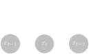
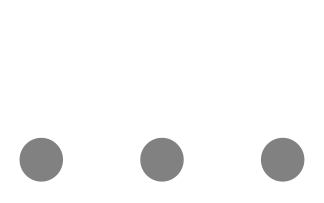
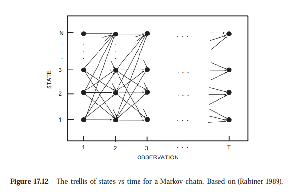

### About Me

::: incremental
- Senior Machine Learning Scientist at Alipes
  - News Trading Algorithms
  - Applied NLP and Machine Learning
- Msc. in Economics from University of Copenhagen from 2016
  - Fell into the "$Math$ and `Code`" pot at University
- Before joining Alipes
  - Automated Sports Betting
  - Co-Founded a Machine Learning Consultancy
  - Co-founded a NLP-powered Legal Tech start-up
  - Consulting at McKinsey
:::

### Slides

{ width=40% }
[duffau.github.io/talks/sequence-tagging][3]

---


### Sequence Tagging

```txt
The price of the [Pizza Margherita] is [10 dollars]. 
                  FOOD                  AMOUNT
```

###  
#### Named Entity Recognition (NER) 
```txt
Jim   worked at    Acme Corp. near the beautiful London Bridge.
PER   O      O     ORG  ORG   O    O   O         LOC    LOC   EOS
```

#### Part-of-Speech (POS)
```txt
Jim   worked at    Acme Corp. near the beautiful London Bridge.
NOUN  VERB   PREP  NOUN NOUN  PREP DET ADJ       NOUN   NOUN  EOS
```

$$\begin{aligned}
\text{Labels}:\quad \mathbf{y} &= \{y_1, y_2, \ldots, y_T\}\\
\text{Features}:\quad \mathbf{x} &= \{\mathbf{x}_1, \mathbf{x}_2, \ldots, \mathbf{x}_T\}
\end{aligned}$$

::: notes
- Emphasis on sequential dependencies on labels
- Mention the tag types
  - NER: "O", "PER", "LOC", "ORG"
:::

## Evolution of NLP and Sequence tagging 

<div class="mermaid">
<pre>
%%{init: {'theme': 'forest'}}%%
timeline

    section 1950-1990<br>Knowledge-Based Methods
        1950s : 1954 IBM-Georgetown machine translation - Sixty Russian sentences translated into English
        1960s : Slow progress in machine translation
              : 1966 ALPAC report leads to defunding of machine translation in the US
        1974-1980 : First AI Winter

    section 1990-2000<br>Statistical Feature-Engineered Methods
        Markov models
          : 1988 First papers using Markov models for PoS tagging
          : 1996 Maximum Entropy Markov Model (MEMM) published
          : 2001 Conditional Random Fields (CRF) introduced
        Data
          : 1993 Penn Treebank Project - 1 mio tokens from WSJ

    section "2010-today<br>Deep Learning-Based Methods"
        Emnbeddings and RNN's
          : 2013 Word Embeddings (Word2Vec, GloVe)
          : 2015 Neural Net Revolution (BiLSTM-CRF)
        Transformers
           : 2017 "Attention is all you need" <br> Introduction of the Transformer model
           : 2020 Large-Scale Pre-trained Language Models (GPT-3)
        LLM
           : 2022 LLM's GPT 3.5 and ChatGPT
           : 2023 LLM zoo and Few-Shot Adaptation
</pre>
</div>


::: notes
- HMM: The first to encode sequential information for PoS
- Rabiner: HMM applied to speech since th 70's but only widely know in "recent years"
  - 33,500 citation
- Penn Treebank Project: 1 mio annotated tokens from WSJ
- MUC 6: https://aclanthology.org/volumes/M95-1/ 
  - Arranged by Naval Command and DARPA
  - A information extraction competition 10-20 participants from industry adn universities 6 months work
  - Defined evalution methods and metrics like precision, recall and f1
  - Task: 
    - MUC-4: "Terrorist activities in Latin America"
    - MUC-6: "Negotiation of Labor Disputes"
  - Coining the "NAmed Entity" at MUC-6
- MEMM:
  - Discriminative markov model - More direct model
  - Allows influence from features at any point in time 
- Condtional Random Fields:
  - Sequential like HMM and MEMM
  - Are discriminative (like MEMM)
  - Allows influence from features at any point in time (Like MEMM)
  - Solves the "label bias" issue of MEMM's
:::


### Papers Using Datasets ^1^

<div style="height:400px">
<canvas data-chart="line">
<!--
{
 "data": {
  "labels": [2020,2021,2022,2023,2024],
  "datasets":[
   {
    "data":[86,88,43,41,18],
    "label":"POS - Penn Treebank",
    "yAxisID": "y",
    "fill": false
   },
   {
    "data":[63,112,105,156, 195],
    "label":"QA - TriviaQA (Wiki + Web)",
    "yAxisID": "y1"
   },
   {
    "data":[16,30,54,160,327],
    "label":"NLI - HellaSwag Sentence Completion",
    "yAxisID": "y1"
   }
  ]
 },
 "options": {
  "scales": {
   "y": {
    "type": "linear",
    "display": true,
    "position": "left",
    "title": {
     "display": true,
     "text": "Published Papers"
    }
   },
   "y1": {
    "type": "linear",
    "display": true,
    "position": "right",
    "title": {
     "display": true,
     "text": "Published Papers"
    },
    "grid": {
     "drawOnChartArea": false
    }
   }
  }
 }
}
-->
</canvas>
</div>

Abstract tasks have taken over lower level tasks

::: footer
^1^ Source: https://paperswithcode.com/datasets
:::

::: notes
- Penn Tree Bank
  - Penn State Tree Bank
  - Initially released in 1992
  - First richly annotated text corpus 
  - 1 mio Annotated tokens (2500 stories) from Wall Street Journal Article from 1989 Wall Street Journal 
  - 2022: Sequence Aligment Ensemble-BART encoder: 98.15 Accuracy
    - Ensemble of BART models 
    - Weighted voting where weights a proportional to avg. alignment score with other predictions in ensemble  
  - 2018: BI-LSTM: 97.96 Accuracy
- TriviaQA: Challenging than QA pairs
  - Long context
  - Answers not optained by span prediction in question or context
  - 2017 University of Washington NLP
  - Claude 5 shots: 87.5 f1 score
  - https://paperswithcode.com/sota/question-answering-on-triviaqa
- HellaSwag: Common sense Natural Language Inference
  - "A woman sits at a piano," -> "She sets her fingers on the keys."
  - Humans have 95% accuracy
  - From Allen Institute for AI a Non-Profit research org.
  - GPT4 10 shots: 95.3 Accuracy
  - https://paperswithcode.com/sota/sentence-completion-on-hellaswag
:::

### NER Tagging Approaches


## CRF Training Demo

###

```{.py include=./demo/fit.py startFrom=1 endAt=4}
```
---


```{.py include=./demo/fit.py startFrom=7 endAt=15}
```
```python
# tokens
["Anders", "loves", "pizza", "from", "Rome"]
```
```python
# features i=2
{"bias":1.0, "word": "pizza", "prev_word": "loves", "next_word": "from", "shape": "pizza"}
```


---

```{.py include=./demo/fit.py startFrom=18 endAt=28}
```
---

```python
X = [
  [{"bias": 1.0, "word": "Anders", ...},..., {"bias": 1.0, "word": "Rome", ...}],
  ...
]

y = [
  ["PER", ..., "LOC"],
  ...
]

```
---

```{.py include=./demo/fit.py startFrom=31 endAt=41}
```
```bash
Iter 1   time=0.20 loss=221774.8 active=177764 feature_norm=1.00
Iter 2   time=0.11 loss=207529.7 active=153314 feature_norm=2.91
Iter 3   time=0.12 loss=172616.6 active=118451 feature_norm=2.39
...
Iter 100 time=0.12 loss=20369.2 active=24307 feature_norm=224.15
Total seconds required for training: 12.497
```
---

```bash
Number of active features: 24307 (574200)
Number of active attributes: 17166 (63791)
Number of active labels: 9 (9)
```
```python
# Worst case (all_possible_states=True and all_possible_transitions=True)
features = (number of attributes * number of labels) 
           + (number of labels * number of labels)
```
---

```{.py include=./demo/fit.py startFrom=49 endAt=51}
```

```bash
              precision    recall  f1-score   support

       B-ORG       0.89      0.57      0.69      1661
      I-MISC       0.74      0.62      0.67       216
       B-LOC       0.89      0.80      0.85      1668
       B-PER       0.90      0.56      0.69      1617
       I-ORG       0.80      0.65      0.72       835
       I-LOC       0.79      0.69      0.74       257
       I-PER       0.89      0.68      0.77      1156
      B-MISC       0.86      0.68      0.76       702

   micro avg       0.87      0.66      0.75      8112
   macro avg       0.84      0.66      0.74      8112
weighted avg       0.87      0.66      0.74      8112
```


## CRF Theory


### CRF Motivation

:::::::::::::: {.columns}
::: {.column width="50%"}
{width=100%}
:::
::: {.column width="50%"}
{width=100%}
:::
::::::::::::::

::: incremental
- *Discriminative* as opposed to *Generative*
- *Richer* and *Non-independent* word features
- *Bidirectional* influence from labels
- Solves the *"label bias"* issue of MEMM
:::


::: notes

- HMM: 
  - y_t is independent of all previous labels given y_t-1
  - x_t is independent of all previous labels and obs given y_t
- MEMM: 
  - y_t is independent of all previous obs and labels given x_t and y_t-1
  - x_t is independent of all other x's

- Relaxed sequential Markov assumption
  - Bidirectional influence from labels 
- Relax the "tag generates word" assumption
  - Allows rich word transformations
- Flexible influence from feature on
- Relaxed Independence Assumptions
  - Non-independent features of the entire observation sequence

. Label Bias
  - MEMM are logistic regression for each state transition given it's current state
  - State transition with high probability concentration
  - Leads to little influence from x-features
  - CRF solves by normalizing over transitions over the whole sequence rather than each step

:::

### Discriminative VS Generative Models

- Generative: $$p(y, \mathbf{x}) = p(\mathbf{y} \vert \mathbf{x})p(\mathbf{x})$$
  - Naive Bayes: $p(y, \mathbf{x}) = p(y;\theta) \prod_{i=1}^K p(x_i | y;\theta)$
- Discriminative: $$p(y | \mathbf{x})$$
  - Logistic regression: $p(y | \mathbf{x};\theta) = 1/(1 + e^{\theta^T \mathbf{x}})$


::: notes
:::


### Discriminative VS Generative Models

- Naive Bayes: $$p(y, \mathbf{x}) = p(y;\theta) \prod_{i=1}^K p(x_i | y;\theta)$$
- Logistic regression: $$p(y | \mathbf{x};\theta) = 1/(1 + e^{\theta^T \mathbf{x}})$$


### Encoding conditional dependence as DAGs 

{width=30%}

$$
p(x_1,x_2,x_3) = p(x_1) \, p(x_2 | x_1) \, p(x_3 | x_1, x_2)
$$


### CRF probabilistic model

### CRF log-linear parametrization

### Fitting CRF's

- How to include "high cardinality" features like current `word`

$$ \ell(\theta) = \sum_{t=1}^{T} \log p\left(\mathbf{y}_t \mid \mathbf{x}_t ; \theta\right)
+ c_1 \lVert \theta \rVert_1 + c_2 \lVert \theta \rVert_2 $$

- Use of Orthant-Wise Limited-memory Quasi-Newton (OWL-QN) [@andrew2007scalable]
- Convex Optimization Problem
 

## Performance comparison

::: custom-small

| Framework          | Algorithm            | CoNLL-2003 | FIN   | BioNLP2004 | BC5CDR | MultiCoNER |
|--------------------|----------------------|------------|-------|------------|--------|------------|
|                    | GliNER               | **92.60**  | -     |            | 88.70  | -          |
| Apache OpenNLP     | Maximum Entropy      | 80.00      | 63.24 | -          | -      | -          |
| Stanford CoreNLP   | CRF                  | 85.18      | 55.25 | **73.26**      | 85.22  | 19.39      |
| Flair              | LSTM-CRF             | 90.35      | **74.23** | 71.64      | **90.27**  | 56.27      |
| spaCy              | CNN-large            | 85.64      | 54.71 | 66.17      | 79.66  | 35.82      |
| Hugging Face       | roberta-base         | 89.92      | 63.18 | 66.56      | 87.08  | 55.21      |
| Hugging Face       | bert-base-cased      | 90.09      | 39.53 | 69.46      | 85.14  | **56.64**      |
| OpenAI             | GPT-4                | 62.74      | 36.70 | 41.32      | 55.67  | 33.61      |

Source: @keraghel2024survey

:::


## Speed comparison

### Big-O reminder

<div class="callout callout-blue">
  <h4 >Definition </h4>
  $f(n) = O(n)$
  $\\[10pt]$
  $\text{if} \quad f(n) \leq C\cdot n \qquad \text{for all} \quad n>n_0.$
</div>

### Inference in CRF

{width=40%}

- Naive implementation: $O(2^n)$

### Inference in Transformers

### Speed benchmarks 


| Model | Time per token |
|:-------|--------:|  
| CRF   |              x |        
| BERT  |              y |
| LSTM  |              z |

### Conclusion

- CRF's are great at identifying entities which are identified by syntactic and some extent semantic information
- Quadratic transformers are MUCH MUCH slower, Sub-quadratic transformers are also MUCH slower. The constant in front of n actually matters!

## References {.allowframebreaks}
::: {#refs}
:::

[1]:	https://www.alipes.dk
[2]:	https://careers.alipes.dk/
[3]:	https://duffau.github.io/talks/sequence-tagging

[image-1]:	./static/alipes-logo.svg