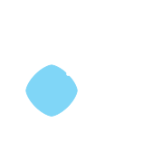
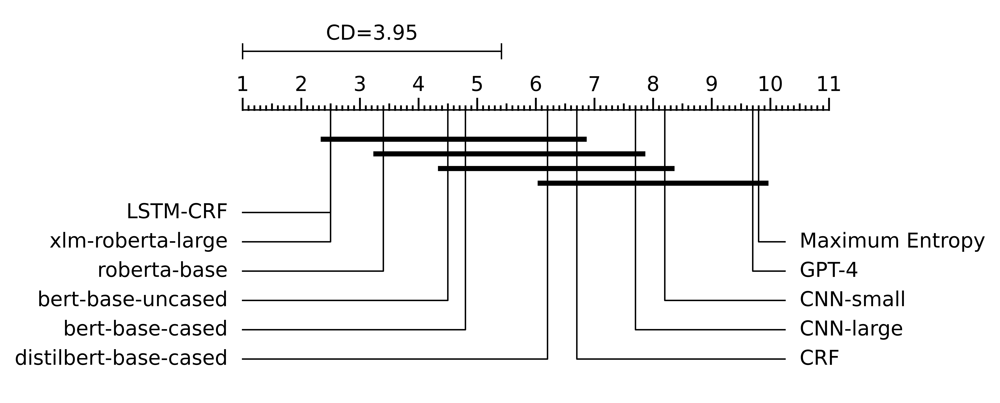
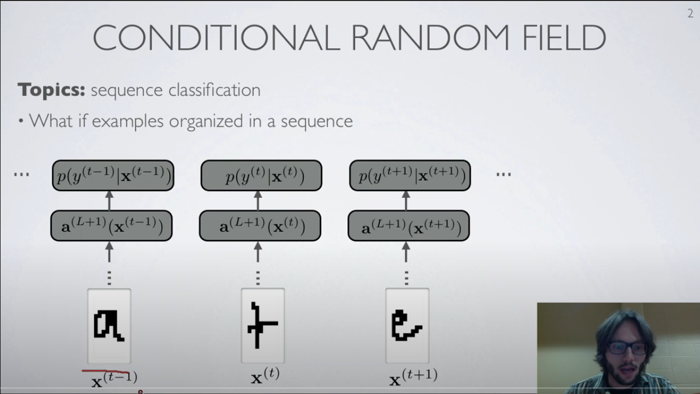
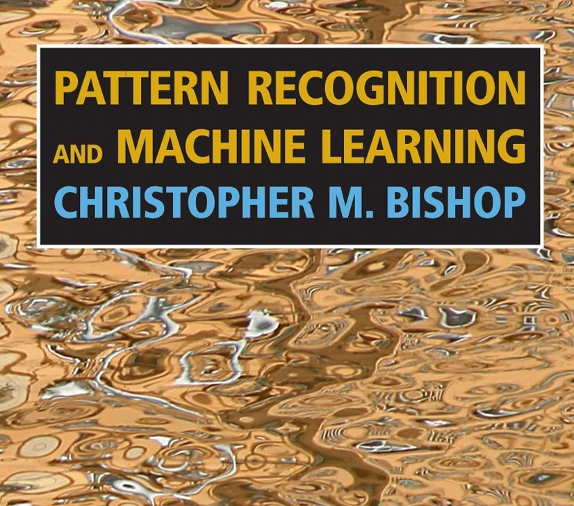

### About Me

::: incremental
- Senior Machine Learning Scientist at Alipes
  - News Trading Algorithms
  - Applied NLP and Machine Learning
- Msc. in Economics from University of Copenhagen from 2016
  - Fell into the "$Math$ and `Code`" pot at University
- Before joining Alipes
  - Automated Sports Betting
  - Co-Founded a Machine Learning Consultancy
  - Co-founded a NLP-powered Legal Tech start-up
  - Consulting at McKinsey
:::

### Slides

{ width=40% }
[duffau.github.io/talks/sequence-tagging][3]

---


### Sequence Tagging

```txt
The price of the [Pizza Margherita] is [10 dollars]. 
                  FOOD                  AMOUNT
```

###  
#### Part-of-Speech (POS)
```txt
Jim   worked at    Acme Corp. near the beautiful London Bridge.
NOUN  VERB   PREP  NOUN NOUN  PREP DET ADJ       NOUN   NOUN  EOS
```

#### Named Entity Recognition (NER) 
```txt
Jim   worked at    Acme Corp. near the beautiful London Bridge.
PER   O      O     ORG  ORG   O    O   O         LOC    LOC   EOS
```

$$\begin{aligned}
\text{Labels}:\quad \mathbf{y} &= \{y_1, y_2, \ldots, y_T\}\\
\text{Features}:\quad \mathbf{x} &= \{\mathbf{x}_1, \mathbf{x}_2, \ldots, \mathbf{x}_T\}
\end{aligned}$$

::: notes
- Emphasis on sequential dependencies on labels
- Mention the tag types
  - NER: "O", "PER", "LOC", "ORG"
:::

### Challenges for NER

:::incremental
- **Challenge 1**: Named entity **strings are rare**
  - Learn entity labels based on context and word derived features
- **Challenge 2**: Neighboring named-entity **labels are dependent**
  - New York -> `LOC` 
  - New York Times -> `ORG`
:::

## Evolution of NLP and Sequence tagging 

<div class="mermaid">
<pre>
%%{init: {'theme': 'forest', 'themeVariables': { 'fontSize': '24px', 'fontFamily': 'Source Sans Pro','cScale0': '#33B0F9', 'cScaleLabel0': '#ffffff',
              'cScale1': '#237cb0','cScaleLabel1': '#ffffff',
              'cScale2': '#125f8c', 'cScaleLabel2': '#ffffff'}}}%%
timeline
    section 1950-1990 Knowledge-Based Methods
        1950s : 1954 IBM-Georgetown machine translation - Sixty Russian sentences translated into English
        1960s : Slow progress in machine translation
              : 1966 ALPAC report leads to defunding of machine translation in the US
        1974-1980 : First AI Winter

    section 1990-2000 Statistical Feature-Engineered Methods
        Markov models
          : 1988 Markov models for PoS tagging
          : 1996 Maximum Entropy Markov Model (MEMM) published
          : 2001 Conditional Random Fields (CRF) introduced
        Data
          : 1985 WordNet - Princeton
          : 1993 Penn Treebank Project - 1 mio tokens from WSJ

    section 2010-today Deep Learning-Based Methods
        Emnbeddings and RNN's
          : 2013 Word Embeddings (Word2Vec, GloVe)
          : 2015 Neural Net Revolution (BiLSTM-CRF)
        Transformers
           : 2017 "Attention is all you need" Introduction of the Transformer model
           : 2020 Large-Scale Pre-trained Language Models (GPT-3)
        LLM
           : 2022 LLM's GPT 3.5 and ChatGPT
           : 2023 LLM zoo and Few-Shot Adaptation
</pre>
</div>


::: notes
- 1954 IBM-Georgtown: "within three or five years, machine translation could well be a solved" problem.
- HMM: The first to encode sequential information for PoS
- Rabiner: HMM applied to speech since th 70's but only widely know in "recent years"
  - 33,500 citation
- Penn Treebank Project: 1 mio annotated tokens from WSJ
- MUC 6: https://aclanthology.org/volumes/M95-1/ 
  - Arranged by Naval Command and DARPA
  - A information extraction competition 10-20 participants from industry adn universities 6 months work
  - Defined evalution methods and metrics like precision, recall and f1
  - Task: 
    - MUC-4: "Terrorist activities in Latin America"
    - MUC-6: "Negotiation of Labor Disputes"
  - Coining the "NAmed Entity" at MUC-6
- MEMM:
  - Discriminative markov model - More direct model
  - Allows influence from features at any point in time 
- Condtional Random Fields:
  - Sequential like HMM and MEMM
  - Are discriminative (like MEMM)
  - Allows influence from features at any point in time (Like MEMM)
  - Solves the "label bias" issue of MEMM's
:::


### Current Trend ^1^

<div style="height:400px">
<canvas data-chart="line">
<!--
{
 "data": {
  "labels": [2020,2021,2022,2023,2024],
  "datasets":[
   {
    "data":[86,88,43,41,18],
    "label":"POS - Penn Treebank",
    "yAxisID": "y",
    "fill": false
   },
   {
    "data":[63,112,105,156, 195],
    "label":"QA - TriviaQA (Wiki + Web)",
    "yAxisID": "y1"
   },
   {
    "data":[16,30,54,160,327],
    "label":"NLI - HellaSwag Sentence Completion",
    "yAxisID": "y1"
   }
  ]
 },
 "options": {
  "scales": {
   "y": {
    "type": "linear",
    "display": true,
    "position": "left",
    "title": {
     "display": true,
     "text": "Published Papers"
    }
   },
   "y1": {
    "type": "linear",
    "display": true,
    "position": "right",
    "title": {
     "display": true,
     "text": "Published Papers"
    },
    "grid": {
     "drawOnChartArea": false
    }
   }
  }
 }
}
-->
</canvas>
</div>

Abstract tasks have taken over lower level tasks

::: footer
^1^ Source: https://paperswithcode.com/datasets
:::

::: notes
- Penn Tree Bank
  - Penn State Tree Bank
  - Initially released in 1992
  - First richly annotated text corpus 
  - 1 mio Annotated tokens (2500 stories) from Wall Street Journal Article from 1989 Wall Street Journal 
  - 2022: Sequence Aligment Ensemble-BART encoder: 98.15 Accuracy
    - Ensemble of BART models 
    - Weighted voting where weights a proportional to avg. alignment score with other predictions in ensemble  
  - 2018: BI-LSTM: 97.96 Accuracy
- TriviaQA: Challenging than QA pairs
  - Long context
  - Answers not optained by span prediction in question or context
  - 2017 University of Washington NLP
  - Claude 5 shots: 87.5 f1 score
  - https://paperswithcode.com/sota/question-answering-on-triviaqa
- HellaSwag: Common sense Natural Language Inference
  - "A woman sits at a piano," -> "She sets her fingers on the keys."
  - Humans have 95% accuracy
  - From Allen Institute for AI a Non-Profit research org.
  - GPT4 10 shots: 95.3 Accuracy
  - https://paperswithcode.com/sota/sentence-completion-on-hellaswag
:::

## What is a Conditional Random Field?

:::incremental
- Lets have a look at a Hidden Markov Model 😅
::: 

### Hidden Markov Model

{width=60%}

- Sequential Model: 
  - Observations: $\mathbf{x} = \{x_1, \ldots, x_T\}$
  - Hidden states: $\mathbf{y} = \{y_1, \ldots, y_T\}$ 

### Hidden Markov Model

{width=60%}

- $y_t$ are drawn from a set of $M$ labels: 
  - e.g. `[O, PER, LOC, ORG]` 
- $x_t$ represents the word identity at step $t$ 

### Hidden Markov Model

{width=60%}


- $p(y_t|y_{t-1}, y_{t-2}, \ldots, y_1) = p(y_t|y_{t-1})$
  - Label depends only on *immediate predecessor* 
- $x_t$ only depend on $y_t$ $$
p(\mathbf{y}, \mathbf{x}) = \prod_{t=1}^T p(y_t|y_{t-1})p(x_t|y_t).
$$

---

- Transition probabilities $p(y_t|y_{t-1})$ are *constant*

|     | PER | LOC | ORG | O |
|-----|-----|-----|-----|---|
| PER | 0.8 | 0.01| 0.01| 0.18 |
| LOC | 0.02| 0.65 | 0.05 | 0.28 |
| ORG | 0.01 | 0.01 | 0.3 | 0.68 |
| O   | 0.05 | 0.1 | 0.1 | 0.75 |

### CRF Motivation

:::::::::::::: {.columns}
::: {.column width="50%"}
{width=100%}
:::
::: {.column width="50%"}
{width=100%}
:::
::::::::::::::

::: incremental
- *Discriminative* as opposed to *Generative*
- *Richer* and *overlapping* word features
- *Bidirectional* influence from labels
:::


::: notes
- Relax the "tag generates word" assumption
  - Allows rich word transformations
  - Rare words (e.g. proper names) will not have occurred in the training set
  - Word identity feature is uninformative
- Relaxed sequential Markov assumption
  - Bidirectional influence from labels
  - Time varying transition probabilities 

- Relaxed Independence Assumptions
  - Non-independent features of the entire observation sequence

. Label Bias
  - MEMM are logistic regression for each state transition given it's current state
  - State transition with high probability concentration
  - Leads to little influence from x-features
  - CRF solves by normalizing over transitions over the whole sequence rather than each step
:::

### Linear Chain CRF definition

$$
p(\mathbf{y}|\mathbf{x}) = \frac{1}{Z(\mathbf{x})} \prod_{t=1}^T \exp \left( \sum_k \theta_k f_k(y_t, y_{t-1}, \mathbf{x}_t) \right)
$$

where,

- $\theta_k \in \mathbb{R}$
- $f_k$ is a real-valued feature function
- $k$ ranges over transitions $(i,j)$ and state-observation pairs $(i,o)$.
- $\mathbf{x}_t$ is a feature vector at time $t$

### Discriminative VS Generative

::: incremental

- Generative: $$p(y, \mathbf{x}) = p(\mathbf{y} \vert \mathbf{x})p(\mathbf{x})$$
  - $p(\mathbf{x})$ is often difficult to model -> Simplifying assumptions
- Discriminative: $$p(y | \mathbf{x})$$
  - No need to model $p(\mathbf{x})$

:::

::: notes
- Generative:: Label vector y can probabilistically “generate” a feature vector x
  - By modelling p(y, x) = p(y) p(x | y)
  - p(x | y) generates the features given the (hidden) labels
- Discriminative: How a feature vector x and assign it a label y
  -  models the "descision rule" directly
- Generative models "too much" by specifying p(x)
- Discriminative models perform worse if the generative model is the true model 
:::

### Discriminative VS Generative

- Generative - Naive Bayes: 
  - $p(y, \mathbf{x}) = p(y;\theta) \prod_{i=1}^K p(x_i | y;\theta)$
  - Assumes $p(x_i| x_{i+1}, \ldots, x_M, y) = p(x_i| y)$
- Discriminative - Logistic regression: 
  - $p(y | \mathbf{x};\theta) = 1/(1 + e^{\theta^T \mathbf{x}})$
  - No assumption on $\mathbf{x}$


### Paths to Linear Chain CRF

{width=40%}

::: footer
Illustration: @sutton2012introduction
:::

### CRF from HMM's cond. distribution

::: custom-medium
\begin{aligned}
p(\mathbf{y}, \mathbf{x}) &= \prod_{t=1}^T p(y_t|y_{t-1})p(x_t|y_t) \\
&= \frac{1}{Z} \prod_{t=1}^{T} \exp (\sum_{i,j \in S} \theta_{ij} \mathbf{1}_{\{y_t = i\}} \mathbf{1}_{\{y_{t-1} = j\}} \\
&+ \sum_{i \in S} \sum_{o \in O} \mu_{oi} \mathbf{1}_{\{y_t = i\}} \mathbf{1}_{\{x_t = o\}})\\
\end{aligned}

\begin{aligned}
\theta_{ij} &= \log p(y^\prime=i|y=j)\quad \text{transition prob.} \\
\mu_{oi} &= \log p(x=o | y=i)\quad \text{word give label prob.} \\
Z &= 1
\end{aligned}
:::

::: notes
- Every homogeneous HMM can be written on this form
- Every distribution which factorizes as above is a HMM
:::

### CRF from HMM's cond. distribution

::: custom-medium
We introduce feature functions:
\begin{aligned}
f_{ij}(y, y^\prime, x) &= f_{ij}(y, y^\prime) = \mathbf{1}_{\{y_t = i\}} \mathbf{1}_{\{y_{t-1} = j\}} \\
f_{io}(y, y^\prime, x) &= f_{io}(y, x) = \mathbf{1}_{\{y_t = i\}} \mathbf{1}_{\{x_t = o\}}
\end{aligned}

$f_k$ indexes over all $f_{io}$ and $f_{ij}$

\begin{aligned}
p(\mathbf{y} , \mathbf{x}) = \frac{1}{Z} \prod_{t=1}^{T} \exp \left( \sum_{k=1}^K \theta_k f_k(y_t, y_{t-1}, x_t) \right)
\end{aligned}
:::

### CRF from HMM's cond. distribution

::: custom-medium
\begin{aligned}
p(\mathbf{y} | \mathbf{x}) = \frac{\prod_{t=1}^{T} \exp \left( \sum_{k=1}^K \theta_k f_k(y_t, y_{t-1}, x_t) \right)}{\sum_{\mathbf{y}^\prime} \prod_{t=1}^{T} \exp \left( \sum_{k=1}^K \theta_k f_k(y_t, y_{t-1}, x_t) \right)}
\end{aligned}

::: incremental
- The above is a CRF factorization 🎉
- But is restricted in two major ways:
  - Indicator only feature functions
  - Only the current word identity $x_t$ enters the model
:::
:::

::: fragment
**Take away**: HMM's are CRF's but with (much) more restricted feature functions  
:::

### CRF from logistic regression

\begin{aligned}
p(\mathbf{y} | \mathbf{x})_{logistic} &= \prod_{t=1}^{T} p(y_t | \mathbf{x}_t)
= \prod_{t=1}^{T} \frac{\exp (\theta_y + \sum_k \theta_{y,k} x_k) }{ \sum_{y^\prime} \exp (\theta_{y^\prime} + \sum_k \theta_{y^\prime,k} x_k)} \\
&= \frac{1}{Z(\mathbf{x})} \prod_{t=1}^{T} \exp (\theta_y + \sum_k \theta_{y,k} x_k) \\
&= \frac{1}{Z(\mathbf{x})} \prod_{t=1}^{T} \exp (\sum_{k} \theta_{y,k} f_{k}(x_k, y_t))
\end{aligned}

### CRF from logistic regression
Adding transitions matrix
\begin{aligned}
p(\mathbf{y} | \mathbf{x})_{CRF} &= \frac{1}{Z(\mathbf{x})} \prod_{t=1}^{T} \exp (\sum_{k} \theta_{y,k} f_{k}(x_k, y_t) + V_{y_{t-1},y_{t}})
\end{aligned}


## CRF Training Demo

[github.com/duffau/talks/tree/master/sequence-tagging/demo](https://github.com/duffau/talks/tree/master/sequence-tagging/demo)

### [CRF Suite](https://www.chokkan.org/software/crfsuite/)

::: columns

::: column

:::

::: column

:::

:::

- Published in 2007
- C++ implementation of CRF training
- Stable, robust and fast!

###

```{.py include=./demo/fit.py startFrom=1 endAt=4}
```
---


```{.py include=./demo/fit.py startFrom=7 endAt=15}
```
```python
# tokens
["Anders", "loves", "pizza", "from", "Rome"]
```
```python
# features i=2
{"bias":1.0, "word": "pizza", "prev_word": "loves", "next_word": "from", "shape": "pizza"}
```


---

```{.py include=./demo/fit.py startFrom=18 endAt=28}
```
---

```python
X = [
      [
        {"bias": 1.0, "word": "Anders", ...},
        ..., 
        {"bias": 1.0, "word": "Rome", ...}
      ],
      ...
]

y = [
  ["PER", ..., "LOC"],
  ...
]

```
---

```{.py include=./demo/fit.py startFrom=31 endAt=41}
```
```bash
Iter 1   time=0.20 loss=221774.8 active=177764 feature_norm=1.00
Iter 2   time=0.11 loss=207529.7 active=153314 feature_norm=2.91
Iter 3   time=0.12 loss=172616.6 active=118451 feature_norm=2.39
...
Iter 100 time=0.12 loss=20369.2 active=24307 feature_norm=224.15
Total seconds required for training: 12.497
```
---

#### Number of features

```bash
Number of active features: 24307 (574200)
Number of active attributes: 17166 (63791)
Number of active labels: 9 (9)

train n sentence: 14041
train n tokens:  203621
```
```python
# Worst case (all_possible_states=True and all_possible_transitions=True)
features = (number of attributes * number of labels) 
           + (number of labels * number of labels)
```
---

```{.py include=./demo/fit.py startFrom=49 endAt=51}
```

```bash
              precision    recall  f1-score   support

       B-ORG       0.89      0.57      0.69      1661
      I-MISC       0.74      0.62      0.67       216
       B-LOC       0.89      0.80      0.85      1668
       B-PER       0.90      0.56      0.69      1617
       I-ORG       0.80      0.65      0.72       835
       I-LOC       0.79      0.69      0.74       257
       I-PER       0.89      0.68      0.77      1156
      B-MISC       0.86      0.68      0.76       702

   micro avg       0.87      0.66      0.75      8112
   macro avg       0.84      0.66      0.74      8112
weighted avg       0.87      0.66      0.74      8112
```
---

#### Transition weights 

```bash
Top likely transitions:
B-PER  -> I-PER   6.683884
B-ORG  -> I-ORG   5.801057
I-ORG  -> I-ORG   5.443938
B-MISC -> I-MISC  4.845435
I-MISC -> I-MISC  4.664166

Top unlikely transitions:
B-LOC  -> I-MISC  -5.871822
O      -> I-PER   -5.968892
O      -> I-LOC   -6.719913
O      -> I-MISC  -7.026504
O      -> I-ORG   -7.582135
```

---

#### State feature weights 

```bash
Top positive state features:
9.733456 I-MISC   shape:Index
8.026899 I-ORG    shape:Newsroom
7.925168 O        shape:said
7.584594 B-MISC   word:english
7.378129 I-MISC   word:classic

Top negative state features:
-4.852697 B-ORG    word:of
-5.058472 I-PER    prev_word:BOS
-5.093323 I-LOC    prev_word:BOS
-6.203149 I-ORG    prev_word:BOS
-6.461425 I-MISC   prev_word:BOS
```
---

<section style="font-size: 10px;">
### Fitting CRF's

- Fit with "high cardinality" features like current `word` $$\ell(\theta) = \sum_{t=1}^{T} \log p\left(\mathbf{y}_t \mid \mathbf{x}_t ; \theta\right) + c_1 \lVert \theta \rVert_1 + c_2 \lVert \theta \rVert_2$$

:::columns

::: {.column width=20%}
{width=100%}
:::


::: {.column width=80%}

:::incremental
* L2: Strictly Convex Optimization
* Efficient use of Quasi-Newton Methods
* L1: Shrinks the parameter space
* Hyperparameter opt. $(c_1,c_2)$
:::
:::

::::

::: notes
- With L1 use of Orthant-Wise Limited-memory Quasi-Newton
- Only the linear chain lead to a strictly convex problem
:::
</section>


## Performance comparison

### Overall Performance


{width=60%}

- Different domains and difficulties
- CRF is from Stanfords Java NLP library using [comprehensive list of engineered features](https://javadoc.io/static/edu.stanford.nlp/stanford-corenlp/1.2.0/edu/stanford/nlp/ie/NERFeatureFactory.html) 
- CRF does well. In the middle of the pack on average.

::: footer
Source: @keraghel2024survey
:::

### Dataset level performance

::: custom-small

| Framework          | Algorithm            | CoNLL-2003 | WNUT2017 | FIN       | BioNLP2004 | BC5CDR     | MultiCoNER |
|--------------------|----------------------|------------|----------|-----------|------------|------------|------------|
|                    | GliNER               | **92.60**  |       -  |   -       |            | 88.70      | -          |
| Apache OpenNLP     | Maximum Entropy      | 80.00      |       -  |   63.24   | -          | -          | -          |
| Stanford CoreNLP   | CRF                  | 85.18      |    8.34  |   55.25   | **73.26**  | 85.22      | 19.39      |
| Flair              | LSTM-CRF             | 90.35      |   38.07  | **74.23** | 71.64      | **90.27**  | 56.27      |
| spaCy              | CNN-large            | 85.64      |    9.78  |   54.71   | 66.17      | 79.66      | 35.82      |
| Hugging Face       | roberta-base         | 89.92      |   41.84  |   63.18   | 66.56      | 87.08      | 55.21      |
| Hugging Face       | bert-base-cased      | 90.09      |   33.32  |   39.53   | 69.46      | 85.14      | **56.64**  |
| OpenAI             | GPT-4                | 62.74      |   18.82  |   36.70   | 41.32      | 55.67      | 33.61      |

:::

::: footer
Source: @keraghel2024survey
:::


### Performance analysis

- CRF has best relative performance on *BioNLP2004* 
  - Entity Types: DNA, protein, cell_type, cell_line, RNA
  - > A low [NM23.H1]DNA gene expression identifying high malignancy in human melanomas.

### Performance analysis

- CRF has worst relative performance on *WNUT 2017*
  - Entity types: Person, Location, Corporation, Consumer good, Creative work, Group
  - "ability to detect and classify novel, emerging, singleton named entities in noisy text."
  - > Tweet: “so.. kktny[Creative work] in 30 mins?”
  - *Kourtney And Kim Take New York 

### Abstraction Hierarchy 


- CRF does not have semantic information e.g. embeddings
- CRF features cannot generalize to unseen words or word contexts based on local
- CRF are just linear machines, no chance of extrapolating abstract information


## Speed comparison

### Big-O reminder

<div class="callout callout-blue">
  <h4 >Definition </h4>
  $f(n) = O(n)$
  $\\[10pt]$
  $\text{if} \quad f(n) \leq C\cdot n \qquad \text{for all} \quad n>n_0.$
</div>

### Inference in CRF

- Partition function is a sum over all possible labeling $$ Z(X) = \sum_{y_1}\sum_{y_2}\ldots\sum_{y_T} \prod_{t=1}^T \exp \left( \sum_k \theta_k f_k(y_t, y_{t-1}, \mathbf{x}_t) \right)$$

{width=50%}

- Naive implementation: $O(M^T)$

### Computing the partition function

\begin{aligned}
Z(X) = \sum_{\mathbf{y}} \exp \left( \sum_{t=1}^T  \sum_k \theta_k f_k(y_t, y_{t-1}, \mathbf{x}_t) \right)
\end{aligned}


### Inference in Transformers


### Speed benchmarks - NER on CoNLL 2003

- Computed on CPU
- Including tokenization and feature generation
- Using "predict single" approach

### Speed benchmarks - NER on CoNLL 2003

::: custom-medium

| Model | Params |  Time per Sentence | Time per Token |
|:------|------:|------:|------:|------:|------:|  
| BERT^1^ | 108.31 M  | 59.31 ms | 4.09 ms |
| CRF^2^ | 0.038 M | 0.119 ms | 0.00823 ms |

:::

::: footer
^1^: kamalkraj/bert-base-cased-ner-conll2003
^2^: Fitted CRF
::::


### Conclusion

::::incremental
- CRF's are great at identifying entities which are 
  - identified by **syntactic** and some extent semantic information
- CRF' are **fast to train**, which enable a quick tag-train loop
  - with few features they do well on small datasets
- CRF's inference is **fast**, especially with C++ implementation
:::

### Learn more

:::::::::::::: {.columns}
::: {.column width="30%"}

[Sutton & McCallum - Intro to CRF](https://www.youtube.com/playlist?list=PL6Xpj9I5qXYEcOhn7TqghAJ6NAPrNmUBH)


:::
::: {.column width="30%"}

[Hugo Larochelle - Neural Network Course](https://www.youtube.com/playlist?list=PL6Xpj9I5qXYEcOhn7TqghAJ6NAPrNmUBH)



:::
::: {.column width="30%"}

[Chap.8 Graphical Models](https://www.microsoft.com/en-us/research/uploads/prod/2006/01/Bishop-Pattern-Recognition-and-Machine-Learning-2006.pdf) 


:::

::::::::::::::


<section style="text-align: left;">
## References {.allowframebreaks}
::: {#refs}
:::
</section>

[1]:	https://www.alipes.dk
[2]:	https://careers.alipes.dk/
[3]:	https://duffau.github.io/talks/sequence-tagging

[image-1]:	./static/alipes-logo.svg